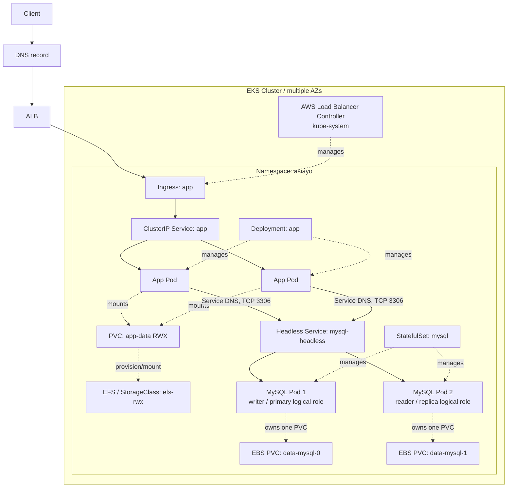

# 第二題：EKS 與 Kubernetes 基礎架構

這份答案把 AWS 基礎設施放在 `terraform/`，Kubernetes 物件放在 `k8s/`。Terraform 只描述要建立的資源；本次只做格式與語法驗證，**沒有執行 `terraform apply`，也沒有連線建立任何 AWS 資源**。

## 題圖解讀

題圖裡有三種關係，不能混在一起看：

1. **實際流量**：使用者先進到 Ingress，Ingress 導向 App Service，再由 Service 依 selector 分配給健康的 App Pods。Deployment 的工作是維護 App Pods，不是替 App 轉送資料庫流量。
2. **controller 管理**：Deployment 管理 App Pods；StatefulSet 管理 MySQL Pods。Ingress 則由 AWS Load Balancer Controller 轉成 ALB 設定。這些都是控制面關係，不是應用程式封包的下一跳。
3. **儲存掛載**：App Pod 掛載 App PVC；PVC 使用 EFS StorageClass 取得 RWX 儲存。MySQL StatefulSet 的 `volumeClaimTemplates` 會為每一個 Pod 建立一張獨立 EBS PVC。這是資源與掛載關係，並不是 `PV → PVC → Deployment → Pod` 的 runtime 流量。

`writer` / `reader` 在這裡只代表 MySQL primary / replica 的邏輯角色；它們不應被當成固定名稱的 App Pod。應用程式以 Kubernetes Service DNS 對內連線，不直接使用 Pod IP。

## 架構



其中實線是存取或應用程式流量；虛線是 controller 或 storage 關係。Ingress 是 `asiayo` namespace 的物件，ALB 則是由 controller 在 AWS 建立的外部資源。EBS 卷有 AZ failure domain，所以 `WaitForFirstConsumer` 讓 Kubernetes 先挑節點再綁定卷；EFS 則提供跨節點可掛載的 RWX 檔案系統。

題圖中的 writer / reader 只代表 primary / replica 的邏輯角色。本答案依題圖保留兩顆 MySQL Pod；因此它提供 StatefulSet identity、各自獨立 storage 與跨 AZ 排程，但尚未啟用資料庫 replication、讀寫分流或 reader pool HA。讀取端真正要高可用時，至少需要 1 writer 加 2 reader，再搭配 replication 與 `mysql-reader` Service／router。

## 目錄

```text
02-eks/
├─ terraform/                  # VPC、EKS、IRSA、EFS、CSI add-ons、ALB controller
├─ k8s/                        # 所有 Kubernetes manifests 與範例設定
├─ scripts/render-manifests.ps1
├─ scripts/validate-selectors.py
└─ README.md
```

所有 namespaced 物件都在唯一 namespace `asiayo`：Deployment、Service、Ingress、PVC、StatefulSet、Secret、ConfigMap、PDB、NetworkPolicy。StorageClass 是 cluster-scoped；動態建立的 PV 也是 cluster-scoped，PVC 才是 namespace 內物件。

## Terraform 設計與變數

Terraform 採用 AWS provider `~> 5.0`、EKS/VPC module `~> 20.0` / `~> 5.0`，以及 Helm provider `~> 2.16`。重點如下：

- VPC 有跨 `az_count` 個 AZ 的 public/private subnets；managed worker node group 只放 private subnets。
- `nat_gateway_mode = "per_az"` 是高可用預設。`single` 只適合為了節省非正式環境成本，會留下 NAT 單點。
- EKS 啟用 OIDC，EBS CSI、EFS CSI、AWS Load Balancer Controller 都使用各自的 IRSA role，避免把 AWS 權限放進 node role。
- EBS CSI 與 EFS CSI 是 EKS add-on；AWS Load Balancer Controller 由 Helm 安裝兩個副本。Ingress 的 `alb` class 與 annotations 才會有 controller 可以處理。
- Terraform 同時建立 EFS 與每個 private subnet 的 mount target。App 的 RWX PVC 對應 EFS；MySQL 的每個 PVC 對應 EBS gp3。

| 變數 | 用途 | 預設值 |
|---|---|---|
| `aws_region` | AWS 區域 | `ap-northeast-1` |
| `project_name` / `environment` | AWS 資源名稱前綴與環境尾碼 | `asiayo-pretest` / `dev` |
| `vpc_cidr` | VPC 網段 | `10.20.0.0/16` |
| `az_count` | 使用 AZ 數（2 到 3） | `2` |
| `nat_gateway_mode` | `per_az` 或 `single` | `per_az` |
| `kubernetes_version` | EKS Kubernetes 版本 | `1.31` |
| `cluster_endpoint_public_access` | 是否開啟 public API endpoint | `true` |
| `node_instance_types` | worker node 機型清單 | `t3.large` |
| `node_capacity_type` | managed node group 容量類型 | `ON_DEMAND` |
| `node_group_min_size` / `node_group_desired_size` / `node_group_max_size` | worker node group 容量 | `2` / `2` / `4` |
| `app_replicas` | App Deployment 副本數 | `2` |
| `mysql_replicas` | baseline MySQL StatefulSet 副本數 | `2` |
| `domain_name` | Ingress host | `app.example.com` |
| `app_image` / `app_container_port` | App image 與 container port | `YOUR_REGISTRY/YOUR_APP:TAG` / `8080` |
| `mysql_image` | baseline StatefulSet 的 MySQL image | `mysql:8.4` |
| `app_pvc_size` / `mysql_pvc_size` | App 共享 EFS、每個 MySQL EBS PVC 大小 | `5Gi` / `20Gi` |
| `aws_load_balancer_controller_chart_version` | ALB controller Helm chart 版本 | `1.8.2` |
| `aws_load_balancer_controller_replicas` | ALB controller 副本數 | `2` |
| `tags` | 額外 AWS tags | `{}` |
完整型別、限制與其餘參數都在 `terraform/variables.tf`。可先複製範例：

```powershell
Set-Location C:\Users\JoeSu\Documents\Codex\2026-08-18\new-chat-2\02-eks\terraform
Copy-Item terraform.tfvars.example terraform.tfvars
# 修改 app_image、domain_name、容量與 tags
```

> `terraform.tfvars` 不是必須提交的檔案；範例檔則可作為團隊的設定起點。

Terraform 成功建立後，會輸出 `cluster_name`、`cluster_endpoint`、`region` 與 `configure_kubectl`。設定 kubeconfig 的格式如下：

```powershell
aws eks update-kubeconfig --region <AWS_REGION> --name <CLUSTER_NAME>
```

## Kubernetes manifests 與渲染方式

`k8s/*.yaml` 中的 `${...}` 是部署前替換的設定值。它們由 `k8s/values.env` 提供；先從範例建立自己的檔案：

```powershell
Set-Location C:\Users\JoeSu\Documents\Codex\2026-08-18\new-chat-2\02-eks
Copy-Item .\k8s\values.env.example .\k8s\values.env
# 將 EFS_FILE_SYSTEM_ID 填成 Terraform output，並換成實際 app image、domain
.\scripts\render-manifests.ps1
```

Terraform 的 `manifest_values` output 會輸出與 `values.env` 對應的非敏感值。Secret 不在 Terraform output；套用前必須把 `mysql-secret.yaml` 的範例密碼換成密碼管理系統提供的值，例如 External Secrets 或 CI 的受控注入。

預設 Ingress 是 HTTP，因為題目沒有給 ACM certificate 與 DNS zone。若已經有 ACM certificate 與 DNS ownership，可在 `values.env` 填入 ARN，並以 `-IncludeTlsExample` 渲染 TLS 範例，再把其 annotations 整合回正式 Ingress。DNS record 應指向 ALB hostname。這些都需要在真實 AWS 帳號中完成。

App Deployment 保留 `DB_HOST`、`DB_PORT`、帳密、資料庫名稱等環境變數，但不假設示範 image 已經實作商業 DB 邏輯。選用的真正 App image 應實作 `/readyz`、`/healthz` 與 `${APP_CONTAINER_PORT}`，或一併調整 probes/port。

## 建置步驟

以下命令是部署時的操作順序；本次工作只執行了不會建立 AWS 資源的驗證命令。

```powershell
# 1. 檢查 Terraform 語法與 provider/module 初始化
Set-Location C:\Users\JoeSu\Documents\Codex\2026-08-18\new-chat-2\02-eks\terraform
terraform init -backend=false
terraform validate

# 2. 審閱 plan 後，才由有權限的人在指定 AWS 帳號執行 apply
terraform plan -out tfplan
# terraform apply tfplan

# 3. 以 Terraform outputs 建 kubeconfig，準備 manifests
aws eks update-kubeconfig --region <AWS_REGION> --name <CLUSTER_NAME>
Set-Location ..
Copy-Item .\k8s\values.env.example .\k8s\values.env
# 編輯 values.env 及 mysql-secret.yaml
.\scripts\render-manifests.ps1

# 4. 先 dry-run，再正式套用
kubectl apply --dry-run=client -f .\work\rendered-k8s
kubectl apply -f .\work\rendered-k8s
```

`app-ingress.yaml` 由 AWS Load Balancer Controller 建 ALB；Service 不需要也不應該改成 `LoadBalancer`。App 到 DB 的設定使用 `mysql-headless.asiayo.svc.cluster.local`，因此不依賴 Pod IP。

## 高可用設計

- **基礎設施**：至少兩個 AZ、private worker nodes、每 AZ 一個 NAT gateway、EFS mount targets、EKS managed node group 最少兩台節點。
- **App**：至少兩個 replicas，zone topology spread、`maxUnavailable: 0` rolling update、readiness/liveness probes、PDB `minAvailable: 1`。Service 只把 ready endpoint 加入流量。
- **App storage**：多副本共用儲存使用 EFS `ReadWriteMany`。EBS 一般是單 AZ、`ReadWriteOnce`，不適合拿同一張 PVC 同時掛到多個 App replicas。
- **MySQL storage 與排程**：每個 StatefulSet Pod 用自己的 EBS gp3 RWO PVC；CSI dynamic provisioning 配合 `WaitForFirstConsumer`，讓卷在 Pod 選定節點後才於同一個 AZ 建立。MySQL Pod 以 required pod anti-affinity 強制分散到不同 worker nodes，並以 `DoNotSchedule` zone topology spread 強制兩顆 Pod 分散在不同 AZ；容量不足時寧可 Pending，也不把兩顆 DB 放到同一個失效範圍。PDB 在維護時最多允許一顆 MySQL Pod 被中斷。
- **網路**：NetworkPolicy 限制 App Pod 對 MySQL Pod 只有 TCP 3306，並保留 App DNS 查詢。Policy 必須由有啟用 NetworkPolicy enforcement 的 CNI 實際執行；EKS VPC CNI 預設行為需依帳號/版本明確啟用這項功能。
- **備份與復原**：production MySQL 還要有定期 logical/physical backup、跨區或跨帳號備份保存、還原演練、監控 replication lag、磁碟容量與 failover 演練。

## MySQL 的限制與正式環境取捨

這份 `mysql-statefulset.yaml` 是 **baseline StatefulSet，不是完整 MySQL HA**。它只保證每個 Pod 有穩定 identity（例如 `mysql-0.mysql-headless`）以及各自獨立的 EBS PVC。直接把 replicas 設成 2 並不會自動完成：

- primary / replica 複寫設定與初始化；
- primary election 與自動 failover；
- 寫入端 `mysql-rw` 與讀取端 `mysql-ro` 路由；
- promotion、split-brain 保護、backup/PITR 與故障演練。

真正需要 DB HA 時，應採用經過維運驗證的 MySQL operator 或 managed database，並補上 GTID/replication、primary election/failover controller，以及 MySQL Router、ProxySQL 或 operator 提供的 read/write Service。完成這些條件後，才可以把 `writer` / `reader` 視為可用的資料庫角色與對外端點。屆時 App ConfigMap 應改指向 router/operator 提供的 Service DNS，而非把 headless Service 誤當成 read/write router。

## 驗證清單

不依賴 AWS credentials 的本地檢查如下：

```powershell
Set-Location C:\Users\JoeSu\Documents\Codex\2026-08-18\new-chat-2\02-eks\terraform
terraform fmt -check
terraform init -backend=false
terraform validate

Set-Location ..
.\scripts\render-manifests.ps1 -ValuesFile .\k8s\values.env.example -OutputDirectory .\work\rendered-k8s
kubectl apply --dry-run=client --validate=false -f .\work\rendered-k8s
python .\scripts\validate-selectors.py .\work\rendered-k8s
```

建立叢集並正式部署後，補做以下驗證：

```powershell
kubectl rollout status deployment/app -n asiayo
kubectl rollout status statefulset/mysql -n asiayo
kubectl get ingress,svc,pods,pvc,pdb -n asiayo
kubectl delete pod -n asiayo -l app.kubernetes.io/name=app
# 觀察 Deployment 補回 Pod、Service endpoints 與 Ingress health。

# 選一台非唯一工作節點，先 cordon/drain；PDB 必須仍允許服務保留可用副本。
kubectl get nodes
kubectl cordon <NODE>
kubectl drain <NODE> --ignore-daemonsets --delete-emptydir-data
```

`drain` 前要確認 App 副本與可用 worker nodes 足夠，並在維護完成後 `kubectl uncordon <NODE>`。MySQL baseline 沒有完整 failover，不能把任一 MySQL Pod 的刪除測試當成資料庫高可用驗證。
