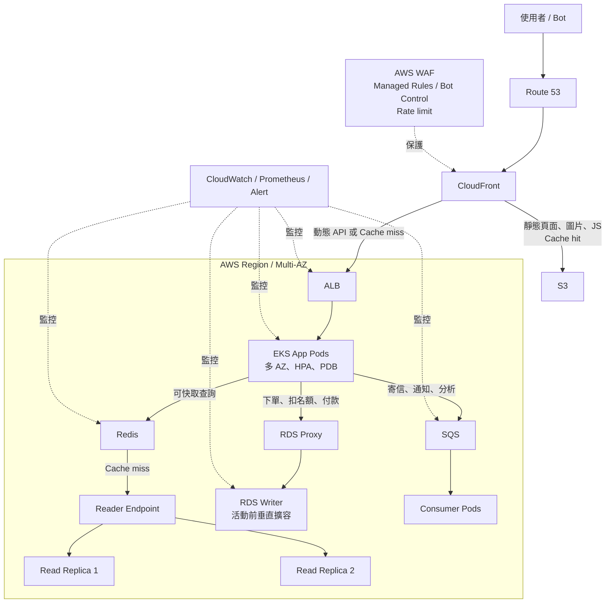

# 情境實戰題一：活動流量暴增

## 題目理解

活動頁即將上線，預估尖峰訪客會是平常的 100 倍以上。目標不是只把機器開大，而是先把不必要的流量與可快取內容擋在外層，讓真正需要即時計算或交易的請求才進到應用程式與資料庫。

## 建議架構

## 各層負責什麼

| 流量類型 | 路徑 | 原因 |
| --- | --- | --- |
| 活動靜態頁、圖片、CSS、JS | CloudFront → S3 | 全球邊緣快取可吸收絕大多數重複請求。 |
| 公開且可短暫過期的活動資料 | CloudFront / Redis | 例如商品清單、活動內容；用 TTL 控制新鮮度。 |
| 動態 API | CloudFront → ALB → EKS App Pods | ALB 只把健康的 target 接入流量；Pod 跨 AZ 分散。 |
| 一般查詢 | App → Redis → Reader Endpoint | Redis hit 直接回應；miss 才讀 Read Replica。 |
| 下單、扣名額、付款確認 | App → RDS Proxy → Writer | 必須走 transaction；Writer 是唯一正確寫入點。 |
| 寄信、推播、分析事件 | App → SQS → Consumer Pods | 不讓使用者請求等待非核心工作完成。 |

### 誰在分流

- **CloudFront**：分散靜態內容與 cache hit；不是應用程式 Pod 的主要負載平衡器。
- **ALB**：動態 API 的主要 L7 分流器，將請求送往跨 AZ 的健康 App Pod target。
- **Kubernetes Service**：定義可接流量的 Pod endpoints；AWS Load Balancer Controller 會同步到 ALB target group。
- **Reader Endpoint**：把新的讀取連線分到多個 Read Replica。
- **SQS**：多個 Consumer Pods 競爭消費訊息。
- **HPA 與 Node Group**：負責擴容，不負責把既有請求分流。

## 高流量時的處理順序

1. **先確認容量基準**：從歷史 ALB/Ingress 資料找出單一 Pod 在 p95 延遲、錯誤率正常時能承受的穩定 RPS。
2. **活動前預擴容**：依「預估尖峰 RPS ÷ 單 Pod 穩定 RPS × 1.3～1.5 餘裕」設定 App `minReplicas`；Node Group 同步提高 `min/desired`，並保留 N+1 Node 容量。
3. **先攔掉不必要流量**：WAF 採 managed rules、bot control、IP reputation 與 path-based rate limit。新規則先以 Count mode 觀察，再逐步切換 Block，避免誤擋正常訪客。
4. **把讀取壓力留在外層**：靜態內容由 CDN；重複查詢優先 Redis。Cache miss 需避免同時打穿資料庫，可對 TTL 加隨機值或合併相同請求。
5. **Writer 只處理必要交易**：活動前提高 Writer instance、IOPS 與 throughput；RDS Proxy 控制連線數。Multi-AZ 是容錯，不是寫入效能擴充。
6. **讀取做水平擴充**：Read Replica 可依讀取壓力增加，應用程式透過 Reader Endpoint 存取。剛寫入後立刻查詢的資料，暫時讀 Writer，避免 replica lag 造成舊資料。
7. **非同步工作脫離主請求**：寄信、通知、分析放入 SQS；Consumer 要具備 retry、DLQ 與 idempotent 處理。

## 防止超賣與重複下單

庫存展示可以快取，但扣庫存、建立訂單與付款確認必須在 Writer 的 transaction 中完成。下單 API 應使用 idempotency key，讓網路重試或重複點擊不會重複扣名額。

## 活動當天的監控與告警

| 元件 | 主要觀察值 |
| --- | --- |
| ALB | RequestCount、TargetResponseTime、HTTP 4xx/5xx、HealthyHostCount |
| EKS | Pod 數量、CPU / Memory、Pending Pods、HPA 是否到上限 |
| Redis | Cache hit rate、latency、memory、eviction |
| RDS | Writer CPU、connections、IOPS、commit latency、Read Replica lag |
| SQS | Queue depth、oldest message age、DLQ 數量 |

## 活動前驗證

- 壓測至預估尖峰的至少 1.3～1.5 倍，確認 p95/p99、錯誤率與資料庫連線數。
- 刪除一個 App Pod、drain 一台 Node，確認 ALB、Service、HPA 與 PDB 能維持服務。
- 確認 EC2、EKS Node、ALB target、RDS 規格與 Read Replica 等 AWS 配額足夠。
- 確認 cache purge / 預熱流程、WAF 規則、rollback 步驟與值班聯絡方式。

## 面試回答摘要

> 流量先由 CloudFront、WAF 與 Redis 吸收；動態 API 由 ALB 分到預先擴好的 EKS App Pods。讀取透過 Reader Endpoint 水平分到 Read Replicas，寫入集中到事先垂直擴容的 Writer，並以 transaction 與 idempotency 避免超賣。寄信、通知與分析改走 SQS，讓核心下單流程在高流量下仍能維持可用。
